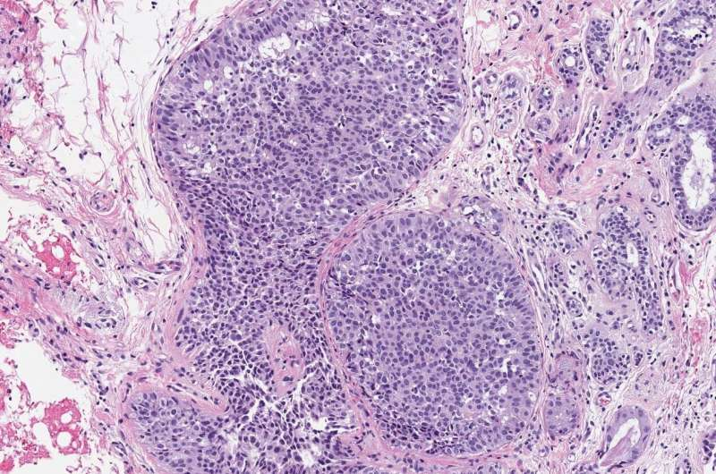

# Breast Cancer and Neural Networks

For this presentation, we are going to focus on breast cancer. According to the World Health Organization, in 2020, there were over 2.3 million women worldwide were diagnosed with breast cancer* and it is projected that this number keeps increasing. The cancer industry is a 150+ billion dollar annual industry. However, prognoses for cancers such as breast cancers haven't improved since the 1940s. What can we do to help with this process?\
\
With the ongoing COVID-19 pandemic, the healthcare industry has been overwhelmed and is constantly realocating resources to help with the impact. This means fewer staff members are able help with life saving treatments, procedures, and tests. By using machine learning, we can help offset this by using neural networks to help detect malignant breat cancer tissue.

### Background

Breast cancer, like other cancers, is the mutation of, breast, tissue that rapidly grows. There are different types of breast cancer and are identified depending on where in the breast they are. It can spread to other parts of the body through blood vessels and lymph nodes. In order to detect growths, annual mammograms are need and to confirm if a growth is cancerous, biopsies would be done.\

\
