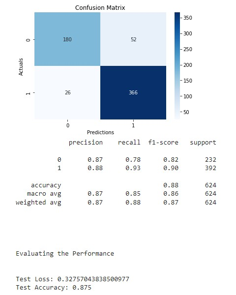

# Breast Cancer and Neural Networks

For this presentation, we are going to focus on breast cancer. According to the World Health Organization, in 2020, there were over 2.3 million women worldwide were diagnosed with breast cancer* and it is projected that this number keeps increasing. The cancer industry is a 150+ billion dollar annual industry. However, prognoses for cancers such as breast cancers haven't improved since the 1940s. What can we do to help with this process?\
\
With the ongoing COVID-19 pandemic, the healthcare industry has been overwhelmed and is constantly realocating resources to help with the impact. This means fewer staff members are able help with life saving treatments, procedures, and tests. By using machine learning, we can help offset this by using neural networks to help detect malignant breat cancer tissue.

### Background

Breast cancer, like other cancers, is the mutation of, breast, tissue that rapidly grows. There are different types of breast cancer and are identified depending on where in the breast they are. It can spread to other parts of the body through blood vessels and lymph nodes. In order to detect growths, annual mammograms are need and to confirm if a growth is cancerous, biopsies would be done.

\
Benign breast tissue biopsy.\
\
Malignant breast tissue biopsy.

### The Data
We obtained ~200,000 50x50 png files of biopsies from Kaggle. We used 26,000 of these photos and randomly divded them into our train and test datasets. No validation set was used.

### Business Question

Using 26,000 50x50 PNG biopsies, can we accurately predict malignant breast cancer cells to help offload the strain of part of the healthcare industry?

### The Models
- Convolutional Neural Network (CNN)\
\
\
\
With our CNN, we hit 87% accuracy rate but our model under performs after about 30 EPOCHs. We aren't minimizling our losses so it shows our model isn't improving.
- VGG16 CNN v1.0\
\
\
\
With our v1.0 VGG16, we hit 88% accuracy rate but it shows a large amount of overfitting.
- VGG16 CNN v2.0\
\
\
Using the same model architecure as before, we changed the activators and optimizers and we were able to get a better performing model while only sacrificing 2% accuracy rate at 86%. This model shows the most potential for improvement. We will continute using this model to see if we can show an increase in accuracy at higher EPOCH levels.

### Results and Future Improvements

All of our neural networks preformed pretty well. For our CNN and VGG16v1.0, we can try to tune the hyperparameters to fit the specific model accordingly. A GridSearch/RandomSearch would work well here even though they are difficult to use with neural networks. With that being said, we ran multiple iterations of each model with different hyperparameters to compensate for the lack of an actual gridsearch. We changed activators, optimizers, number of neurons, early stops, and levels. In the future different model architecture will be used to see if it helps with the underperformance of our CNN. For our VGG16v2.0, we will increase the early stop and increase the batch sizes and EPOCHs to see if it continuely improves and plateaus. We only used VGG16 and VGG19 for our project as they are known for image classifcation. VGG19s are not shown in this Readme as they did not show improvement in models.

### Short Team Goals

The image classification use of neural network can be used in the future to help modernize and improve efficiency in other areas of medicine as well. The goal is to help improve and increase efficiency to help reduce the cost of healthcare and offset the demands currently on the healthcare industry. By allowing computers to help us (with proper supervision), we can get better, more precise results to help improve processes and quality of life for healthcare workers.
